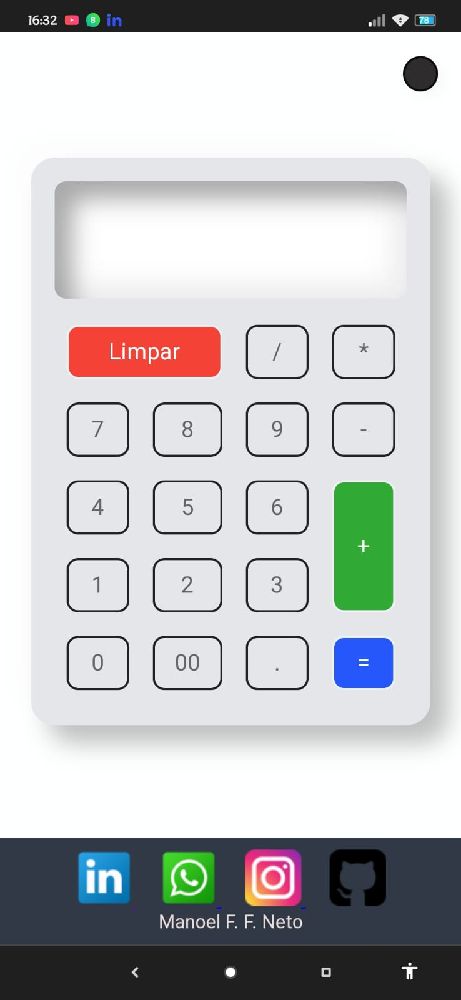
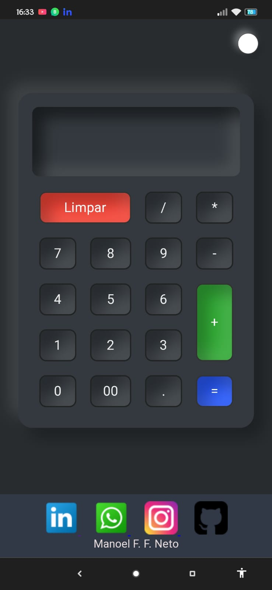

# Calculadora com Modo Dark

> Uma aplicação web simples e interativa de calculadora com suporte a modo dark, construída com HTML, CSS e JavaScript.


## Índice

- [Visão Geral](#visão-geral)
- [Funcionalidades](#funcionalidades)
- [Capturas de Tela](#capturas-de-tela)
- [Tecnologias Utilizadas](#tecnologias-utilizadas)
- [Como Começar](#como-começar)
  - [Pré-requisitos](#pré-requisitos)
  - [Instalação](#instalação)
- [Uso](#uso)
- [Contribuindo](#contribuindo)


## Visão Geral

Esta calculadora é uma aplicação web simples construída com tecnologias da web padrão, incluindo HTML, CSS e JavaScript. Ela oferece funcionalidades básicas de cálculo, permitindo que os usuários realizem operações de adição, subtração, multiplicação e divisão, bem como a capacidade de limpar a tela e exibir o resultado. Além disso, a calculadora é responsiva e pode ser usada tanto com o mouse quanto com o teclado. É um projeto ótimo para iniciantes que desejam praticar suas habilidades de desenvolvimento web e aprender mais sobre como criar uma interface de usuário interativa.

## Funcionalidades

- **Modo Dark Select**: Alterna entre o modo claro e escuro para melhorar a experiência do usuário.
- **Operações Básicas**: Suporte a adição, subtração, multiplicação e divisão.
- **Responsiva**: Utilizável em diversos dispositivos, como desktops, tablets e smartphones.
- **Interatividade**: Suporte tanto para entradas via mouse quanto teclado.

## Capturas de Tela

 

## Tecnologias Utilizadas

- HTML
- CSS
- JavaScript

## Como Começar

Estas instruções fornecerão uma cópia do projeto em funcionamento na sua máquina local para desenvolvimento e testes.

### Pré-requisitos

Nenhum pré-requisito especial é necessário para rodar este projeto, além de um navegador web moderno.

### Instalação

1. Clone o repositório

    ```bash
    git clone https://github.com/usuario/calculadora-modo-dark.git
    ```

2. Entre no diretório do projeto

    ```bash
    cd calculadora-modo-dark
    ```

3. Abra o arquivo `index.html` no seu navegador preferido.

## Uso

Abra o arquivo `index.html` no navegador e utilize a calculadora para realizar operações matemáticas básicas. Use o botão de modo dark para alternar entre os modos claro e escuro.

## Contribuindo

1. Faça um fork do projeto
2. Crie uma branch para sua feature (`git checkout -b feature/nova-feature`)
3. Commit suas alterações (`git commit -m 'Adiciona nova feature'`)
4. Faça um push para a branch (`git push origin feature/nova-feature`)
5. Abra um Pull Request


